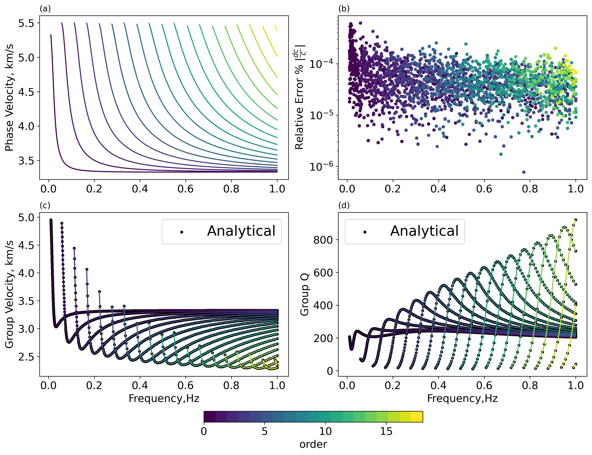
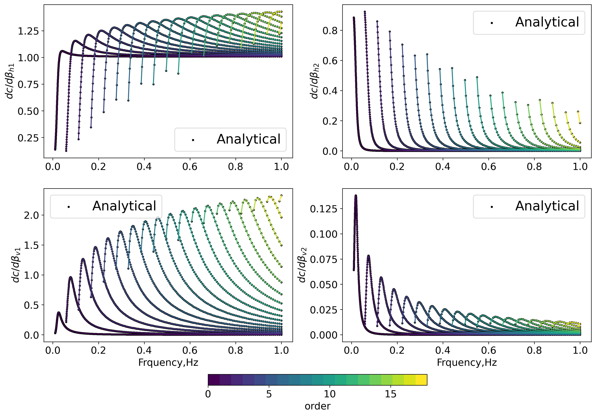
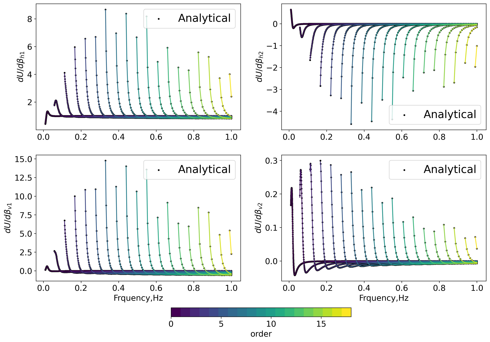
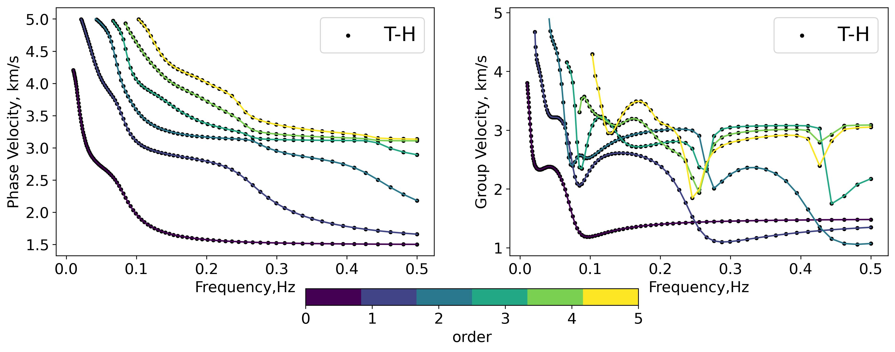
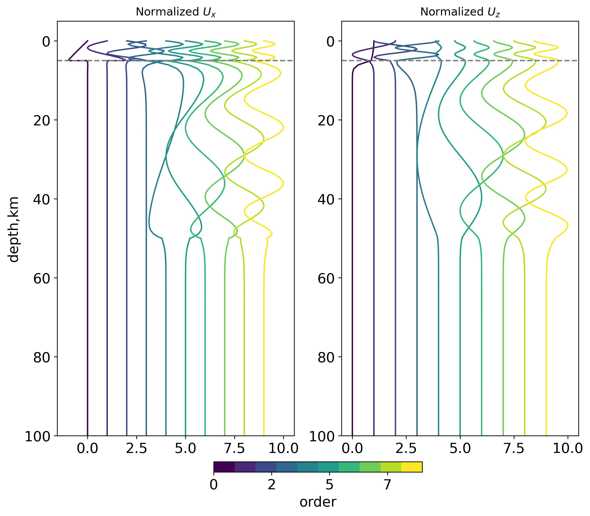
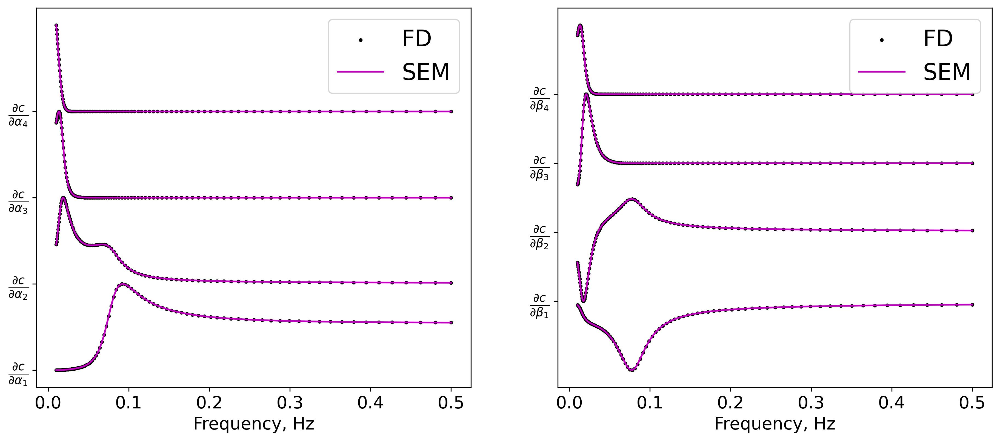
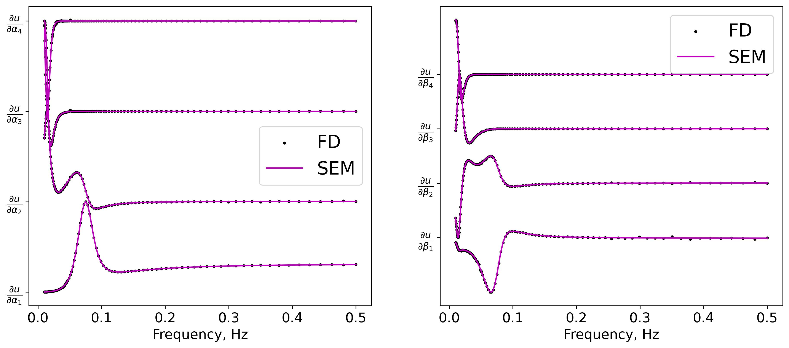

# Gallery
## Two layer Love wave Model
| Layer Number    | h | $\rho$ | $\beta_{v}$| $\beta_{h}$ | $Q_L$ | $Q_N$ |
| -------- | ------- |---- |--| --| -- | --|
| 1  | 35   | 2.8 | 3.0 | 3.3 | 220 | 200 |
| 2 | $\infty$ | 3.2 | 5.0 | 5.5 |330 |300|

*Benchmark of phase/group/group Q ith Analytical Solution*

*Benchmark of phase velocity sensitivity kernels ith Analytical Solution*

*Benchmark of group velocity sensitivity kernels ith Analytical Solution*

## Scholte Wave example
| Layer Number    | h | $\rho$ | $\alpha$| $\beta$ |
| -------- | ------- |---- |--| --|
| 1  | 5   | 1.0 | 1.5 | 0 |
| 2  | 45   | 2.57 | 5.22 | 3.1 |
| 3  | 50   | 2.95 | 6.94 | 4.0 |
| 2 | $\infty$ | 3.57 | 5.0 | 8.75 |5.0 |

*Benchmark of phase/group/ velocities with CPS330.*

*Normalized eigenfunctions*

*Benchmark of phase velocity derivativates with FD approximation*

*Benchmark of group velocity derivativates with FD approximation*

<!-- # Gallery
### Benchmark: SWDTTI with CPS330

### HTI model: Phase velocity vs. Azimuthal angle

### Fluid-Elastic Coupling phase and group velocity

### Acoustic  -->